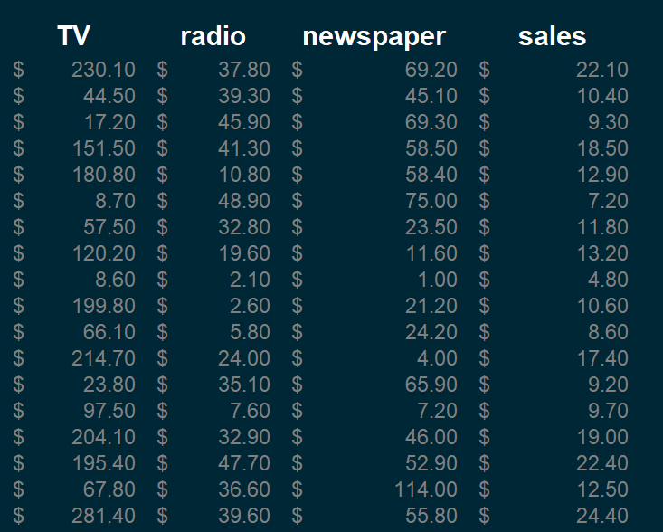

# **
Media Mix Optimization: Predicting Sales Impact with Advertisement Channels
**

## 1. Introduction

For this project we set out to leverage the power of statistics and analytics to uncover insights into the impact of various advertisement channels on sales. In today's highly competitive business landscape, organizations are constantly seeking ways to optimize their marketing strategies and allocate resources effectively. Understanding the influence of different media channels on sales performance is crucial for making informed decisions and maximizing return on investment.

By building a analysing historical sales data and advertisement expenditures, this project endeavors to provide actionable insights into the effectiveness of different media channels in driving sales. Through comprehensive data analysis, feature selection, and model training, we aim to create a robust prediction model that can accurately estimate the impact of advertisement media on sales outcomes.

By employing advanced regression modeling techniques and exploring the relationships between advertisement media and sales performance, this project will enable businesses to make data-driven decisions regarding media allocation. The insights gained from the prediction model will aid in optimizing marketing campaigns, allocating resources efficiently across various media channels, and enhancing the overall effectiveness of advertising efforts.

In this project Microsoft Excel, Python and R  will be used to conduct the analysis.

We hope to drive growth, boost sales, and achieve marketing success in the dynamic and ever-evolving business landscape.

## 2. Data

The Advertising data set consists of the sales of product
in 200 diferent markets, along with advertising budgets for the product in
each of those markets for three diferent media: `TV`, `radio`, and `newspaper`. A screenshot of the data can be seen below:

Below is a short explanation of the columns:
* TV: Expense made on TV advertisement
* radio: Expense made on radio advertisement
* newspaper: Expenses made on newspaper advertisement
* Sales: Amount generated from sales of product

## 3. Business Objective

On the basis of the data available, we need a marketing plan for next year that will result in
high product sales. What information would be useful in order to provide
such a recommendation? Few important questions that we might seek address:

**a. Is there a relationship between advertising budget and sales?**

-  Our firts goal is to determine whether the data available provide evidence of an association between advertisement expenditure and sales. If there is week or no evidence, then we might argue that no money should be spent on advertisement

   $H_{0}$: No relationship between advertisement and sales 

   $H_{1}$: The is a relationship between advertisemnt and sales
   

**b. How strong is the relationship between advertising budget and sales?**

-  Should our finding suggest ther is a relationship between advertisement and sales, we would like to know the strength of this relationship. In other words, given a certain advertising budget, can we predict sales with a high level of accuracy? This would be a strong relationship. Or is a prediction of sales based on advertising expenditure only slightly better than a random guess? This would be a weak relationship
    
    $H_{0}$: There's no or week relationship between advertisement and sales
    
    $H_{1}$: There's strong relationship between advertisement and sales

**c. Which media contribute to sales?**
-   We would also like to know if all three media —TV, radio, and newspaper contribute to sales,or do just one or two of the media contribute? To answer this question,we must find a way to separate out the individual effects of each medium when we have spent money on all three media

    $H_{0}$: All three media contribute equally amount to sales
    
    $H_{1}$: All three media contribut different amount to sales
    

**d. How accurately can we estimate the effect of each medium on sales?**
- For every dollar spent on advertising in a particular medium, by what amount will sales increase? How accurately can we predict this amount of increase?

    $H_{0}$: There is no unit sales increase with unit dollar spent on advertisemet
    
    $H_{1}$: There is a unit sales increase with unit dollar spent on advertisement

**e. How accurately can we predict future sales?**
- For any given expenditure on television, radio, or newspaper advertising, what is our prediction for sales, and what is the accuracy of this prediction?

    $H_{0}$: 
    
    $H_{1}$: 

**f.  Is the relationship linear?**
- f there is approximately a straight-line relationship between advertising expenditure in the various media and sales, then linear regression is an appropriate tool. If not, then it may still be possible to transform the predictor or the response so that linear regression can be
used.

    $H_{0}$: 
    
    $H_{1}$:

**f.  Is there synergy among the advertising media?**
- Perhaps spending $50,000 on television advertising and $50,000 on radio advertising results in more sales than allocating $100,000 to either television or radio individually. In marketing, this is known as a synergy effect, while in statistics it is called an interaction effect.

    $H_{0}$: 
    
    $H_{1}$: 

